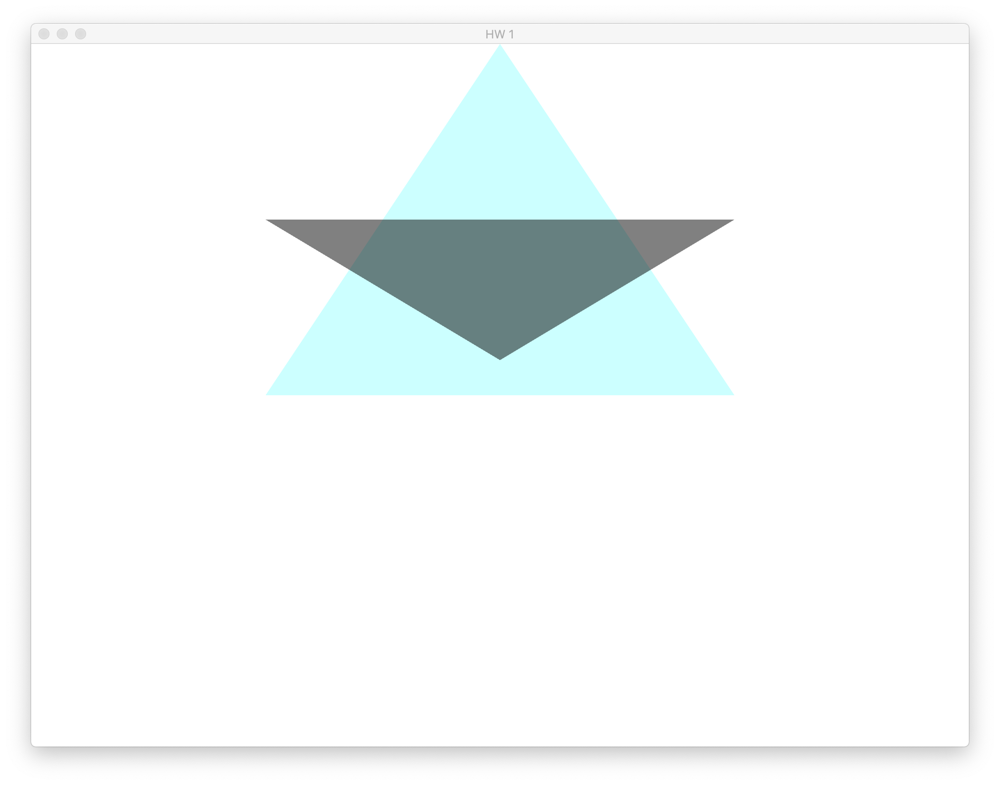
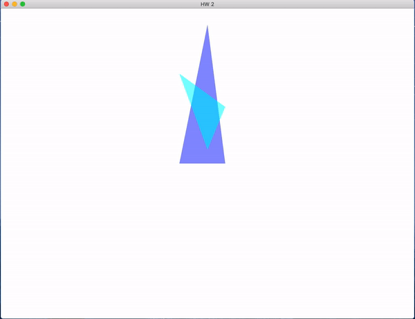

# MiptGraphics

Задания к курсу компьютерная графика МФТИ ФИВТ 2021. 

Преподаватель - Владимир Широкун

## [Задание 1](Task1)
Нарисовать пересекающиеся треугольники разных цветов.

## [Задание 2](Task2)
Добавить вращение камеры

## [Задание 3](Task3)
Нарисовать любую 3d фигуру, добавить вращение

